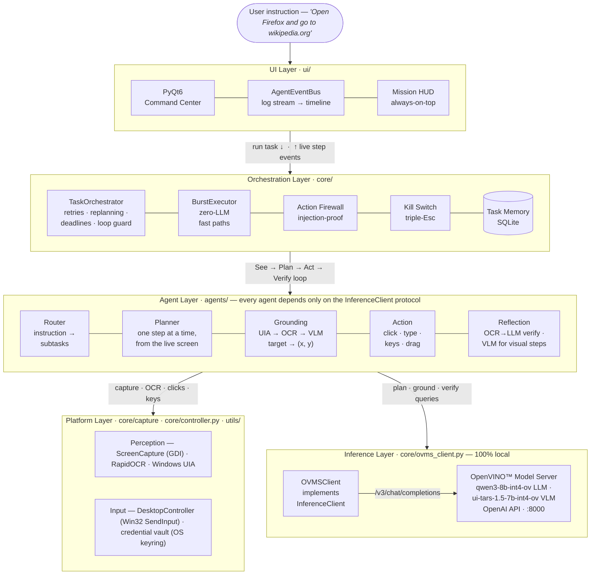

<div align="center">

<a href="https://github.com/openvinotoolkit/openvino"></a>

# Desktop GUI Agent

**Tell your computer what to do — in plain English.**
An autonomous desktop agent that observes your screen, plans, clicks, types, and
**verifies every single step** — running entirely on your own machine via
OpenVINO™ Model Server. No cloud. No API keys. No data ever leaves your desk.

[](https://www.python.org/downloads/)
[](#installation)
[](LICENSE)
[](https://github.com/openvinotoolkit/model_server)
[](https://www.riverbankcomputing.com/software/pyqt/)
[](#running-tests)

[How It Works](#how-it-works) •
[Architecture](#architecture) •
[Installation](#installation) •
[Safety](#safety) •
[Contributing](CONTRIBUTING.md)

</div>

---

## How It Works

The agent runs a closed-loop **See → Plan → Act → Verify** cycle at every step:

```
User Instruction
      │
      ▼
┌─────────────┐   decompose    ┌──────────────────────┐
│ Router Agent│ ──────────────▶│  Sub-tasks (ordered) │
└─────────────┘                └──────────────────────┘
                                          │
                          ┌───────────────┘  for each sub-task
                          ▼
                ┌──────────────────┐
                │  Planning Agent  │  plans ONE step at a time
                └──────────────────┘  from the LIVE screen state
                          │
              ┌───────────┴────────────┐
              ▼                        ▼
    ┌──────────────────┐    ┌──────────────────┐
    │ Grounding Agent  │    │  Action Agent    │
    │  UIA / OCR / VLM │    │  clicks, types,  │
    │  → screen (x, y) │    │  presses keys    │
    └──────────────────┘    └──────────────────┘
                                     │
                                     ▼
                          ┌──────────────────────┐
                          │  Reflection Agent    │  OCR→LLM verifies outcome
                          └──────────────────────┘  (VLM check for visual steps)
                                     │
                          confirmed? ─▶ next step
                             failed? ─▶ retry / replan
```

Planning is **dynamic**: the planner sees the live screen before every step, so
it recovers from popups, focus changes, and failed actions instead of blindly
executing a stale plan.

### Grounding pipeline (fastest → most robust)

| Stage | Method | When it fires |
|-------|--------|---------------|
| 0 | Windows UIA accessibility tree | Exact coordinates in ~20–50 ms |
| 1 | OCR fuzzy-match (RapidOCR) | Target text is visible on screen |
| 2 | VLM direct (x, y) coordinates (UI-TARS) | Icon, field, or unlabelled element |

If all stages miss, the grounder asks the LLM for alternative label phrasings
and retries the pipeline.

---

## Architecture

The system is organised into five layers. Every agent depends only on the
`InferenceClient` protocol — never on a concrete backend — so the inference
engine is drop-in replaceable.



The orchestrator owns the loop — it consults memory before routing, screens
every typed command through the firewall, and arms the kill switch for the
duration of a task. Agents do one job each and touch the world only through
the platform layer. All model calls funnel through a single client behind the
`InferenceClient` protocol (`core/protocols.py`), which is what let the
inference backend move to OpenVINO™ Model Server without touching an agent.

| Agent | Consumes | Produces |
|-------|----------|----------|
| Router | instruction, screen context, memory hints | ordered `SubTask` list |
| Planner | subtask, live OCR context, step history | next `ActionStep` (or *done*) |
| Grounding | target description, screen | `(x, y)` + confidence |
| Action | grounded step | real mouse / keyboard events |
| Reflection | post-action screen | verdict: success · fail · uncertain |

The orchestrator also handles failure modes that show up in real runs: a
**loop guard** stops a plan stuck repeating the same step, **idempotency
protection** never blind-retries non-repeatable actions like typing or Enter,
**visual replanning** escalates to the VLM when text-based planning stalls,
and tasks completed via a recovery path are quarantined from success memory
so broken plans can't poison future routing.

---

## Models

Model ids live in [`config.py`](config.py) — the single source of truth.

| Role | Model (OVMS servable) | Source | Purpose |
|------|-----------------------|--------|---------|
| **LLM** | `qwen3-8b-int4-ov` | [`OpenVINO/Qwen3-8B-int4-ov`](https://huggingface.co/OpenVINO/Qwen3-8B-int4-ov) (pre-converted) | Routing, planning, reflection reasoning |
| **VLM** | `ui-tars-1.5-7b-int4-ov` | [`ByteDance-Seed/UI-TARS-1.5-7B`](https://huggingface.co/ByteDance-Seed/UI-TARS-1.5-7B) (converted to INT4 on first run) | GUI grounding, visual verification |

Both models are served by a **single OpenVINO™ Model Server instance** on one
OpenAI-compatible endpoint (`http://localhost:8000/v3/chat/completions`) and
selected per request by the `model` field. On a 16 GB Intel® GPU both INT4
models (~5 GB weights each) plus KV-cache (2 GB each by default) stay resident
— no model swapping. Adjust `KV_CACHE_SIZE_GB` and `TARGET_DEVICE` (GPU / CPU
/ NPU / AUTO) in [`config.py`](config.py) for your hardware.

---

## Requirements

| | Minimum | Recommended |
|-|---------|-------------|
| OS | Windows 10 | Windows 11 |
| Python | 3.10 | 3.12 |
| RAM | 16 GB | 32 GB |
| GPU VRAM | 16 GB Intel Arc / iGPU (both models resident) | 24 GB+ (larger KV-cache) |
| Disk | 20 GB free | 30 GB free |

---

## Installation

```powershell
# 1. Clone and set up a virtual environment
git clone https://github.com/Shehrozkashif/intel-openvino-desktop-agent.git
cd intel-openvino-desktop-agent
python -m venv venv
venv\Scripts\activate

# 2. Install Python dependencies (includes the model conversion toolchain)
pip install -r requirements.txt

# 3. Install OpenVINO™ Model Server — native binary (ovms.exe)
#    Prerequisite: Microsoft Visual C++ Redistributable (x64)
#    https://aka.ms/vs/17/release/vc_redist.x64.exe
#    Use curl.exe / tar.exe explicitly (PowerShell aliases `curl` to Invoke-WebRequest):
curl.exe -L https://github.com/openvinotoolkit/model_server/releases/download/v2026.2/ovms_windows_2026.2.0_python_on.zip -o ovms.zip
tar.exe -xf ovms.zip          # extracts .\ovms\ containing ovms.exe + setupvars.bat
setx OVMS_DIR "%CD%\ovms"     # tell start.py where to find ovms.exe (restart shell after this)

# 4. Run — first launch downloads/converts models (30–60 min), then starts the GUI
python start.py
```

> **Do NOT run `setupvars.bat` in your agent terminal.** It sets
> `PYTHONHOME`/`PYTHONPATH` to OVMS's bundled Python, which hijacks your venv
> (`ModuleNotFoundError: No module named 'config'`). `start.py` sources it
> **inside the `ovms.exe` subprocess only** — just run `python start.py` from
> a clean shell.

`start.py` does the rest on every run: detects your GPU, prepares both
OpenVINO models in the OVMS model repository, starts OpenVINO™ Model Server
on the native `ovms.exe` binary (found via `OVMS_DIR` / `OVMS_PATH` /
`PATH`), waits for both models to load, and opens the agent GUI.

```powershell
# Pre-fill the instruction box
python start.py --prompt "Open VS Code and enable autosave"

# Pre-fill and run immediately on startup
python start.py --prompt "Search for OpenVINO documentation" --auto-run
```

### Using the GUI

1. **Type** your instruction in the command dock (e.g. `"Open Firefox and go to wikipedia.org"`)
2. **Run** — the window minimises, an always-on-top mission HUD appears, and the agent takes over
3. **Watch** Mission Control: a live timeline of every subtask, step, grounding hit, and verification verdict
4. **Stop** any time — from the HUD, the GUI, or the keyboard kill switch

Other pages: **Agent Sessions** (task history & re-run), **Workflows**,
**Memory** (learned tasks & failure patterns), **Screen History** (frames
recorded during missions), and **Settings**.

<details>
<summary><b>Manual setup, without start.py</b></summary>

```powershell
pip install -r requirements.txt   # includes optimum-intel[openvino] and nncf

# 1. Pull / convert both models into the OVMS repository (writes models/config.json)
python tools/ovms/export_model.py text_generation `
  --source_model OpenVINO/Qwen3-8B-int4-ov  --model_name qwen3-8b-int4-ov `
  --weight-format int4 --config_file_path models/config.json `
  --model_repository_path models --target_device GPU --cache_size 2

python tools/ovms/export_model.py text_generation `
  --source_model ByteDance-Seed/UI-TARS-1.5-7B --model_name ui-tars-1.5-7b-int4-ov `
  --weight-format int4 --config_file_path models/config.json `
  --model_repository_path models --target_device GPU --cache_size 2

# 2. Serve both from one OVMS instance. The device is baked into each servable
#    at export time (step 1's --target_device) — do NOT pass --target_device
#    alongside --config_path. setupvars must run in the ovms.exe process only:
.\ovms\setupvars.bat && .\ovms\ovms.exe --config_path models\config.json --rest_port 8000

# 3. Launch the agent against the running server
python main.py
```

```powershell
# Checking the server
curl http://localhost:8000/v1/config        # servable states (AVAILABLE?)
```

</details>

---

## Project Structure

```
intel-openvino-desktop-agent/
├── start.py                  ← single entry point (run this)
├── main.py                   ← Qt app + orchestrator wiring
├── config.py                 ← model ids & server settings (single source of truth)
│
├── agents/
│   ├── action.py              # ActionExecutionAgent — executes steps
│   ├── grounding.py           # UIGroundingAgent — text → (x, y), OCR engine
│   ├── planning.py            # PlanningAgent — plans one step at a time
│   ├── reflection.py          # ReflectionAgent — OCR→LLM / VLM verification
│   └── router.py              # RouterAgent — decomposes instructions
│
├── core/
│   ├── capture/
│   │   ├── screenshot.py      # Windows screen capture (GDI via PIL.ImageGrab)
│   │   └── screen_snapshot.py # Foreground/background-aware OCR snapshot
│   ├── burst_executor.py      # Fast multi-action sequences (no per-step LLM)
│   ├── windows_uia.py         # Stage 0: Windows UIA accessibility tree
│   ├── ovms_client.py         # OVMSClient — LLM + VLM via OpenVINO Model Server
│   ├── protocols.py           # Shared data models + InferenceClient protocol
│   ├── action_firewall.py     # Deterministic destructive-command classifier
│   ├── controller.py          # Keyboard/mouse (raw Win32 SendInput via ctypes) + kill switch
│   └── orchestrator.py        # Central coordinator — runs the full loop
│
├── memory/task_memory.py      # SQLite task + failure-pattern memory
├── utils/                     # Platform detection, clipboard, credentials
├── ui/                        # PyQt6 command-center GUI
├── tests/
│   ├── unit/                  # Unit tests — fast, no backend or desktop required
│   ├── e2e/                   # End-to-end pipeline checks (require a running OVMS)
│   └── live/                  # Live tests against a real desktop (require OVMS + display)
└── requirements.txt
```

---

## Safety

- **Action firewall** — every `type` step is screened by a deterministic
  classifier before execution; destructive shell commands (`rm -rf /`, `mkfs`,
  fork bombs, …) are blocked. It never calls a model, so it is immune to
  prompt injection.
- **Kill switch** — press Esc three times, or slam the mouse into the
  top-left corner, to stop the agent instantly and release all held keys.
- **Wall-clock budgets** — a stuck task aborts (default 10 min/task,
  4 min/subtask) instead of running unbounded.
- **Credential safety** — `{{cred:site:field}}` values live in the OS keyring,
  are redacted from all logs, and are cleared from the clipboard after paste.
- **Keyboard injection** uses raw `win32 SendInput` via `ctypes` — standard
  OS-level events, same as a real keyboard.
- **Agent window minimises** before executing tasks so the agent never clicks
  its own UI.
- **Max retries** — each step retries at most 3 times before the task is
  marked failed.

---

## Running Tests

```powershell
venv\Scripts\activate

# Unit tests — fast, no backend or desktop required
pytest

# Lint
ruff check .

# End-to-end pipeline check (requires OVMS running + a live desktop)
python tests/e2e/test_pipeline.py
```

---

## Troubleshooting

| Problem | Solution |
|---------|----------|
| `Could not connect to OpenVINO Model Server` | Run `python start.py`; check `ovms.log` and `curl localhost:8000/v1/config` |
| Native `ovms.exe` not found | Set `OVMS_DIR` to the folder containing `ovms.exe` |
| `ModuleNotFoundError: No module named 'config'` | You ran OVMS's `setupvars` in your agent shell — it hijacks the venv's Python. Open a fresh terminal, activate the venv, and run `python start.py` |
| `Requested KV-cache size is larger than available memory` | Lower `KV_CACHE_SIZE_GB` in `config.py` (default: 2 GB per model). Total must satisfy: 2 × `KV_CACHE_SIZE_GB` + ~10 GB model weights < your GPU's VRAM |
| Model files have `Access is denied` | Delete the model folder from an **elevated** terminal: `rd /s /q models\ui-tars-1.5-7b-int4-ov`, then re-run `python start.py` to re-export |
| Model loads on CPU instead of GPU | Set `TARGET_DEVICE="GPU"` in `config.py`; install Intel GPU drivers |
| Agent clicks wrong place | Lower screen scaling in Windows display settings |
| First run takes very long | Expected — UI-TARS conversion (INT4 quantization of a 7B model) takes 30–60 minutes. The LLM (Qwen3) is pre-converted and downloads in minutes. Subsequent runs skip this step |

---

## Contributing

Contributions are welcome — see [CONTRIBUTING.md](CONTRIBUTING.md) for the
development setup, code style, and architecture constraints.

## Acknowledgements

Built on the shoulders of excellent open-source work:
[OpenVINO™](https://github.com/openvinotoolkit/openvino) ·
[OpenVINO™ Model Server](https://github.com/openvinotoolkit/model_server) ·
[UI-TARS](https://github.com/bytedance/UI-TARS) ·
[Qwen](https://github.com/QwenLM) ·
[RapidOCR](https://github.com/RapidAI/RapidOCR) ·
[PyQt6](https://www.riverbankcomputing.com/software/pyqt/)

## License

Apache License 2.0 — see [LICENSE](LICENSE).

---

<div align="center">

**Google Summer of Code 2026 — Intel® OpenVINO™ Desktop Agent**

</div>
