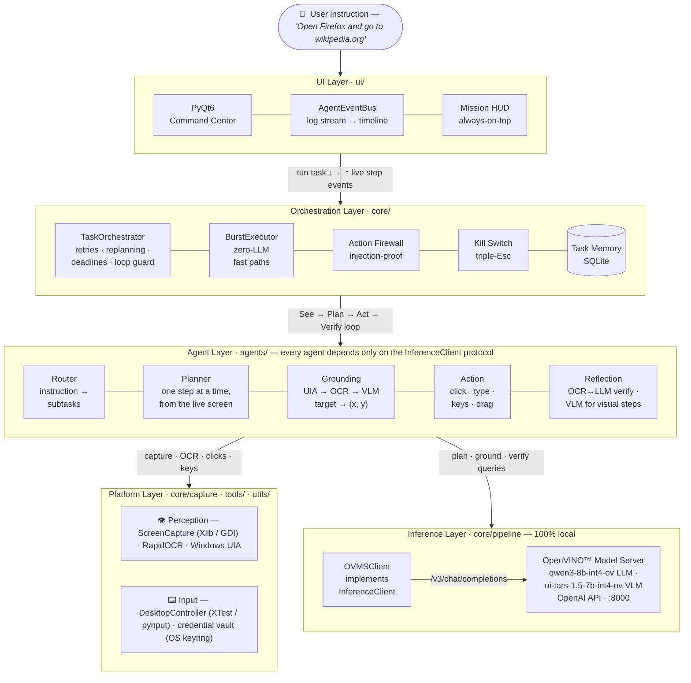

<div align="center">

<a href="https://github.com/openvinotoolkit/openvino"></a>

# Desktop GUI Agent

**Tell your computer what to do — in plain English.**
An autonomous desktop agent that observes your screen, plans, clicks, types, and
**verifies every single step** — running entirely on your own machine.
No cloud. No API keys. No data ever leaves your desk.

[](https://www.python.org/downloads/)
[](#installation)
[](LICENSE)
[](https://github.com/openvinotoolkit/model_server)
[](https://www.riverbankcomputing.com/software/pyqt/)
[](#running-tests)

[Quick Start](#quick-start) •
[How It Works](#how-it-works) •
[Architecture](#architecture) •
[Safety](#safety) •
[Installation](#installation) •
[Contributing](CONTRIBUTING.md)

</div>

---

## Demo

```
User:  "Open Firefox and navigate to wikipedia.org"

Agent: [ROUTER]   2 sub-tasks: open Firefox → navigate to URL
       [PLAN]     Super → click search bar → type firefox → Enter
       [GROUND]   OCR found "Type to search" at (850, 78)
       [ACTION]   key_press super
       [VERIFY]   ✓ Activities overlay appeared (conf=1.00)
       [ACTION]   type firefox
       [VERIFY]   ✓ Firefox search result visible (conf=1.00)
       [ACTION]   key_press enter
       [VERIFY]   ✓ Firefox window opened (conf=0.95)
       [PLAN]     hotkey ctrl+l → type wikipedia.org → Enter
       [ACTION]   hotkey ctrl+l
       [VERIFY]   ✓ Address bar focused (conf=1.00)
       [ACTION]   type wikipedia.org
       [ACTION]   key_press enter
       [DONE]     Task completed in 29s
```

---

## Highlights

|     | Feature | What it means |
|-----|---------|---------------|
| 🔒 | **100 % local** | All inference runs on your Intel® GPU via OpenVINO™ Model Server — nothing is sent to the cloud |
| 👁 | **Verifies every step** | A reflection agent checks the screen after each action; failures trigger automatic replanning |
| 🎯 | **3-stage grounding** | UIA accessibility tree → OCR fuzzy-match → vision model, fastest path first |
| 🛡 | **Prompt-injection-proof firewall** | Destructive shell commands are blocked by a deterministic classifier that never calls a model |
| 🚨 | **Hardware-style kill switch** | Triple-Esc or slam the mouse into the top-left corner — the agent stops instantly |
| 🧠 | **Learns from experience** | Successful task plans and known failure patterns are stored in SQLite and reused |
| ⚡ | **Burst execution** | Recognised multi-step patterns (context menus, rename dialogs) run with zero LLM calls |
| 🖥 | **Cross-platform** | Windows 10/11 and Linux (X11), with per-platform input and capture backends |
| 💾 | **Fits 6 GB VRAM** | Quantised 7–8 B models with automatic model swapping — no datacenter GPU required |

---

## How It Works

The agent runs a closed-loop **See → Plan → Act → Verify** cycle at every step:

```
User Instruction
      │
      ▼
┌─────────────┐   decompose    ┌──────────────────────┐
│ Router Agent│ ──────────────▶│  Sub-tasks (ordered) │
└─────────────┘                └──────────────────────┘
                                          │
                          ┌───────────────┘  for each sub-task
                          ▼
                ┌──────────────────┐
                │  Planning Agent  │  plans ONE step at a time
                └──────────────────┘  from the LIVE screen state
                          │
              ┌───────────┴────────────┐
              ▼                        ▼
    ┌──────────────────┐    ┌──────────────────┐
    │ Grounding Agent  │    │  Action Agent    │
    │  UIA / OCR / VLM │    │  clicks, types,  │
    │  → screen (x, y) │    │  presses keys    │
    └──────────────────┘    └──────────────────┘
                                     │
                                     ▼
                          ┌──────────────────────┐
                          │  Reflection Agent    │  OCR→LLM verifies outcome
                          └──────────────────────┘  (VLM check for visual steps)
                                     │
                          confirmed? ─▶ next step
                             failed? ─▶ retry / replan
```

Planning is **dynamic**: the planner sees the live screen before every step, so
it recovers from popups, focus changes, and failed actions instead of blindly
executing a stale plan.

### Grounding Pipeline (fastest → most robust)

| Stage | Method | When it fires |
|-------|--------|---------------|
| 0 | Windows UIA accessibility tree | Windows only; exact coordinates in ~20–50 ms |
| 1 | OCR fuzzy-match (RapidOCR) | Target text is visible on screen — all platforms |
| 2 | VLM direct (x, y) coordinates (UI-TARS) | Icon, field, or unlabelled element |

If all stages miss, the grounder asks the LLM for alternative label phrasings
and retries the pipeline.

---

## Architecture

The system is organised into five layers. Every agent depends only on the
`InferenceClient` protocol — never on a concrete backend — so inference
engines are drop-in replaceable.



**How to read it:** the orchestrator owns the loop — it consults memory before
routing, screens every typed command through the firewall, and arms the kill
switch for the duration of a task. Agents do one job each and touch the world
only through the platform layer. All model calls funnel through a single
client behind the `InferenceClient` protocol (`core/protocols/a2a.py`) — which
is what let the inference backend be swapped to OpenVINO™ Model Server without
touching a single agent.

| Agent | Consumes | Produces |
|-------|----------|----------|
| Router | instruction, screen context, memory hints | ordered `SubTask` list |
| Planner | subtask, live OCR context, step history | next `ActionStep` (or *done*) |
| Grounding | target description, screen | `(x, y)` + confidence |
| Action | grounded step | real mouse / keyboard events |
| Reflection | post-action screen | verdict: success · fail · uncertain |

### Reliability Engineering

Real desktops are messy. The orchestrator defends against the failure modes
that actually happen in live runs:

- **Loop guard** — per-action limits on identical repeated steps; a plan stuck
  in a loop is detected and stopped instead of clicking forever.
- **Idempotency protection** — non-repeatable actions (typing, Enter, paste)
  are never blind-retried after an uncertain verdict; the planner re-evaluates
  the live screen instead, so text is never typed twice.
- **Deterministic command verification** — terminal commands are verified
  against the real filesystem (file created / deleted / fresh mtime), because
  a successful shell command prints nothing and OCR would misread that
  silence as failure.
- **Launch verification** — "open X" subtasks are confirmed by process and
  window checks; focusing an *existing* window does not count as launching a
  new one.
- **Visual replanning** — when text-based planning stalls, the agent escalates
  to the vision model with a full screenshot to see what OCR can't.
- **Degraded-run quarantine** — tasks that finish through a recovery path are
  never stored as reusable successes, so broken plans cannot poison future
  routing.
- **Memory with failure patterns** — known-bad target/action combinations are
  fed to the planner as warnings before it repeats them.

---

## Models

Model ids live in [`config.py`](config.py) — the single source of truth.

| Role | Model (OVMS servable) | Source | Purpose |
|------|-----------------------|--------|---------|
| **LLM** | `qwen3-8b-int4-ov` | [`OpenVINO/Qwen3-8B-int4-ov`](https://huggingface.co/OpenVINO/Qwen3-8B-int4-ov) (pre-converted) | Routing, planning, reflection reasoning |
| **VLM** | `ui-tars-1.5-7b-int4-ov` | [`ByteDance-Seed/UI-TARS-1.5-7B`](https://huggingface.co/ByteDance-Seed/UI-TARS-1.5-7B) (converted to INT4 on first run) | GUI grounding, visual verification |

Both models are served by a **single OpenVINO™ Model Server instance** on one
OpenAI-compatible endpoint (`http://localhost:8000/v3/chat/completions`) and
selected per request by the `model` field. On a 16 GB Intel® GPU both INT4
models (~4.5 GB each) stay resident — no model swapping.

> **OpenVINO™ backend** — inference runs entirely through OpenVINO™ Model Server
> (OVMS) on Intel® CPU / iGPU / Arc™ GPU / NPU. The `InferenceClient` protocol in
> `core/protocols/a2a.py` keeps every agent backend-agnostic; `OVMSClient`
> (`core/pipeline/ovms_client.py`) is the only component that talks to the server.
> Set the device in [`config.py`](config.py) via `TARGET_DEVICE`.

---

## Quick Start

```bash
git clone https://github.com/Shehrozkashif/intel-openvino-desktop-agent.git
cd intel-openvino-desktop-agent
python -m venv venv && source venv/bin/activate    # Windows: venv\Scripts\activate
pip install -r requirements.txt
python start.py
```

`start.py` does the rest: detects your GPU, prepares both OpenVINO models in the
OVMS model repository (converting UI-TARS on first run), starts OpenVINO™ Model
Server (native binary if present, otherwise the Docker image), waits for both
models to load, and opens the agent GUI.

```bash
# Pre-fill the instruction box
python start.py --prompt "Open VS Code and enable autosave"

# Pre-fill and run immediately on startup
python start.py --prompt "Search for OpenVINO documentation" --auto-run
```

---

## Requirements

| | Minimum | Recommended |
|-|---------|-------------|
| OS | Ubuntu 22.04 / Windows 10 | Ubuntu 24.04 / Windows 11 |
| Python | 3.10 | 3.12 |
| RAM | 16 GB | 32 GB |
| VRAM | 6 GB (models swap) | 24 GB (both models resident) |
| Disk | 20 GB free | 30 GB free |
| Display | X11 (Linux) | X11 or Windows desktop |

---

## Installation

### Linux

```bash
# 1. Clone the repository
git clone https://github.com/Shehrozkashif/intel-openvino-desktop-agent.git
cd intel-openvino-desktop-agent

# 2. Create and activate a virtual environment
python3 -m venv venv
source venv/bin/activate

# 3. Install Python dependencies
pip install -r requirements.txt

# 4. Install OpenVINO™ Model Server  (native binary or Docker)
#    Docker (simplest on Linux):
docker pull openvino/model_server:latest-gpu
#    Native binary: see https://docs.openvino.ai/latest/model-server/ovms_docs_deploying_server.html

# 5. (first run only) install the conversion toolchain for UI-TARS
pip install "optimum-intel[openvino]" nncf
```

> **No sudo required.** `start.py` extracts the missing Qt system library
> (`libxcb-cursor0`) to `~/.local_xcb` automatically on first run.

### Windows

```powershell
# 1. Clone the repository
git clone https://github.com/Shehrozkashif/intel-openvino-desktop-agent.git
cd intel-openvino-desktop-agent

# 2. Create and activate a virtual environment
python -m venv venv
venv\Scripts\activate

# 3. Install Python dependencies
pip install -r requirements.txt

# 4. Install OpenVINO™ Model Server (native Windows binary — recommended for Arc GPU)
#    Prerequisite: Microsoft Visual C++ Redistributable (x64)
#    https://aka.ms/vs/17/release/vc_redist.x64.exe

#    Download + unpack the python_on build (GenAI LLM/VLM servables need Python).
#    Use curl.exe / tar.exe explicitly (PowerShell aliases `curl` to Invoke-WebRequest):
curl.exe -L https://github.com/openvinotoolkit/model_server/releases/download/v2026.2/ovms_windows_2026.2.0_python_on.zip -o ovms.zip
tar.exe -xf ovms.zip      # extracts an .\ovms\ folder containing ovms.exe + setupvars.bat

#    Point start.py at the folder that contains ovms.exe (restart the shell after setx):
setx OVMS_DIR "$PWD\ovms"

# 5. (first run only) install the conversion toolchain for UI-TARS
pip install "optimum-intel[openvino]" nncf
```

> **Do NOT run `setupvars.bat` / `setupvars.ps1` in the terminal you use for the
> agent.** The `python_on` package sets `PYTHONHOME`/`PYTHONPATH` to OVMS's
> bundled Python, which hijacks your venv (you'll get `ModuleNotFoundError: No
> module named 'config'`). `start.py` sources `setupvars.bat` **inside the
> `ovms.exe` subprocess only**, so just run `python start.py` from a clean
> shell — no manual `setupvars` needed.

> **Note:** On Windows, `pynput` uses `win32 SendInput` for keyboard injection —
> no extra drivers or admin rights needed.

> **Native vs Docker on Windows:** prefer the native binary above. Docker Desktop
> on Windows cannot pass the Intel Arc™ GPU into a Linux container, so OVMS in
> Docker only runs on CPU there. Native `ovms.exe` uses the GPU directly.

---

## Running the Agent

```bash
# Linux
source venv/bin/activate
python start.py

# Windows
venv\Scripts\activate
python start.py
```

`start.py` handles everything automatically:

1. **Environment setup** — configures `LD_LIBRARY_PATH` on Linux (no sudo)
2. **GPU detection** — finds Intel / AMD / NVIDIA GPUs for the startup banner
3. **Model prep** — pulls `qwen3-8b-int4-ov` and converts UI-TARS to INT4 into the OVMS repo (first run only)
4. **Server start** — launches OpenVINO™ Model Server (native binary, else Docker) serving both models on port 8000
5. **Readiness wait** — polls until both models report AVAILABLE
6. **Launches** `main.py` — the agent GUI opens

<details>
<summary><b>First-run output</b></summary>

```
╔══════════════════════════════════════════════╗
║       Desktop GUI Agent — Startup Check      ║
╚══════════════════════════════════════════════╝

Platform: Linux
  [OK] Linux environment configured

GPU Detection:
  [INTEL] GPU0: Intel(R) Arc(TM) 140V GPU (16GB)
  OVMS target device: GPU

Models:
  [OK] qwen3-8b-int4-ov         already in repository
  [OK] ui-tars-1.5-7b-int4-ov   already in repository

OpenVINO Model Server:
  [OK] OVMS ready — both models loaded (12s)

Starting Desktop GUI Agent...
```

</details>

### Using the GUI

1. **Type** your instruction in the command dock (e.g. `"Open Firefox and go to wikipedia.org"`)
2. **Run** — the window minimises, an always-on-top mission HUD appears, and the agent takes over
3. **Watch** Mission Control: a live timeline of every subtask, step, grounding hit, and verification verdict
4. **Stop** any time — from the HUD, the GUI, or the keyboard kill switch

Other pages: **Agent Sessions** (task history & re-run), **Workflows**,
**Memory** (learned tasks & failure patterns), **Screen History** (frames
recorded during missions), and **Settings**.

---

## Safety

- **Action firewall** — every `type` step is screened by a deterministic
  classifier before execution; destructive shell commands (`rm -rf /`, `mkfs`,
  fork bombs, …) are blocked. It never calls a model, so it is immune to
  prompt injection.
- **Kill switch** — press Esc three times, or slam the mouse into the
  top-left corner, to stop the agent instantly and release all held keys.
- **Wall-clock budgets** — a stuck task aborts (default 10 min/task,
  4 min/subtask) instead of running unbounded.
- **Credential safety** — `{{cred:site:field}}` values live in the OS keyring,
  are redacted from all logs, and are cleared from the clipboard after paste.
- **Keyboard injection** uses `XTest` (Linux) or `win32 SendInput` (Windows) —
  standard OS-level events, same as a real keyboard.
- **Agent window minimises** before executing tasks so the agent never clicks
  its own UI.
- **Stop button** in the GUI interrupts execution after the current step
  completes.
- **Max retries** — each step retries at most 3 times before the task is
  marked failed.

---

## Platform Differences

| Feature | Linux | Windows |
|---------|-------|---------|
| Keyboard backend | **XTest** (Xlib) — injects at X11 server level; reaches GNOME Shell global capture | **pynput** — uses win32 `SendInput`; works with all Windows apps |
| Screenshot backend | **Xlib `get_image`** — focus-neutral, does not dismiss overlays | **PIL `ImageGrab`** — GDI BitBlt |
| Grounding Stage 0 | — | **UIA accessibility tree** (~20–50 ms, exact) |
| App launcher key | `Super` (GNOME Activities) | `Win` (Start Menu) |
| libxcb-cursor | Extracted automatically to `~/.local_xcb` (no sudo) | Not needed |
| Wayland | ❌ X11 session required (`GDK_BACKEND=x11`) | N/A |

---

## Project Structure

```
intel-openvino-desktop-agent/
├── start.py                       ← single entry point (run this)
├── main.py                        ← Qt app + orchestrator wiring
├── config.py                      ← model ids & server settings (single source of truth)
│
├── agents/
│   ├── action/action_agent.py        # ActionExecutionAgent — executes steps
│   ├── grounding/grounding_agent.py  # UIGroundingAgent — text → (x, y), OCR engine
│   ├── planning/planning_agent.py    # PlanningAgent — plans one step at a time
│   ├── reflection/reflection_agent.py# ReflectionAgent — OCR→LLM / VLM verification
│   └── router/router_agent.py        # RouterAgent — decomposes instructions
│
├── core/
│   ├── capture/
│   │   ├── screenshot.py          # Cross-platform screen capture (Xlib/PIL)
│   │   └── screen_snapshot.py     # Foreground/background-aware OCR snapshot
│   ├── executor/burst_executor.py # Fast multi-action sequences (no per-step LLM)
│   ├── grounding/windows_uia.py   # Stage 0: Windows UIA accessibility tree
│   ├── pipeline/ovms_client.py    # OVMSClient — LLM + VLM via OpenVINO Model Server
│   ├── protocols/a2a.py           # Shared data models + InferenceClient protocol
│   ├── safety/action_firewall.py  # Deterministic destructive-command classifier
│   └── orchestrator.py            # Central coordinator — runs the full loop
│
├── memory/task/task_memory.py     # SQLite task + failure-pattern memory
├── tools/desktop_control/controller.py  # Keyboard/mouse (XTest + pynput) + kill switch
├── utils/                         # Platform detection, clipboard, credentials
├── ui/                            # PyQt6 command-center GUI
├── tests/unit/                    # Unit tests (no backend required)
├── e2e_test.py                    # End-to-end pipeline check
├── requirements.txt
└── run.sh                         # Linux convenience wrapper (sets LD_LIBRARY_PATH)
```

---

<details>
<summary><h2>Manual Setup (without start.py)</h2></summary>

If you prefer to control each step manually (these are exactly what `start.py`
automates). The export helper is the one bundled with OVMS —
[`demos/common/export_models/export_model.py`](https://github.com/openvinotoolkit/model_server/tree/main/demos/common/export_models).

```bash
pip install "optimum-intel[openvino]" nncf

# 1. Pull / convert both models into the OVMS repository (writes models/config.json)
python export_model.py text_generation \
  --source_model OpenVINO/Qwen3-8B-int4-ov  --model_name qwen3-8b-int4-ov \
  --weight-format int4 --config_file_path models/config.json \
  --model_repository_path models --target_device GPU

python export_model.py text_generation \
  --source_model ByteDance-Seed/UI-TARS-1.5-7B --model_name ui-tars-1.5-7b-int4-ov \
  --weight-format int4 --config_file_path models/config.json \
  --model_repository_path models --target_device GPU

# 2. Serve both from one OVMS instance.
#    NOTE: the device is baked into each servable at export time (step 1's
#    --target_device); do NOT pass --target_device alongside --config_path
#    ("Model parameters in CLI are exclusive with the config file").
#    native (Linux):
ovms --config_path models/config.json --rest_port 8000
#    native (Windows) — source setupvars in the SAME shell that runs ovms.exe
#    (do this in a separate terminal from your venv to avoid breaking Python):
.\ovms\setupvars.bat
.\ovms\ovms.exe --config_path models\config.json --rest_port 8000
#    or Docker (Linux only for GPU; --device /dev/dri is not available on Windows):
docker run --rm -p 8000:8000 -v $PWD/models:/models:rw --device /dev/dri \
  openvino/model_server:latest-gpu \
  --config_path /models/config.json --rest_port 8000

# 3. Launch the agent against the running server
python main.py
```

### Checking the server

```bash
curl http://localhost:8000/v1/config        # servable states (AVAILABLE?)
curl http://localhost:8000/v3/chat/completions \
  -H "Content-Type: application/json" \
  -d '{"model":"qwen3-8b-int4-ov","messages":[{"role":"user","content":"hi"}],"max_tokens":10}'
```

If a model fails to load, check `ovms.log`. For GPU execution make sure the Intel
GPU drivers are installed and (Docker on Linux) `/dev/dri` is passed through.

</details>

---

## Running Tests

```bash
source venv/bin/activate        # Linux
# venv\Scripts\activate         # Windows

# Unit tests — fast, no backend or desktop required
pytest

# Lint
ruff check .

# End-to-end pipeline check (requires OVMS running + a live desktop)
python e2e_test.py
```

---

## Performance Reference

Measured on an Intel® Arc™ 140V (16 GB) with OVMS (both INT4 models resident):

| Operation | Latency |
|-----------|---------|
| Screen capture (Xlib / GDI) | < 20 ms |
| Windows UIA grounding | 20 – 50 ms |
| OCR (RapidOCR) | < 150 ms |
| VLM grounding (`ui-tars-1.5-7b-int4-ov`) | 1 – 3 s |
| LLM planning (`qwen3-8b-int4-ov`) | 1 – 3 s |
| Full task (3–5 steps) | 15 s – 60 s |

---

## Troubleshooting

| Problem | Solution |
|---------|----------|
| `qt.qpa.plugin: could not load xcb` | Run `start.py` — it auto-extracts `libxcb-cursor0` |
| `Could not connect to OpenVINO Model Server` | Run `python start.py`; check `ovms.log` and `curl localhost:8000/v1/config` |
| Native `ovms` not found | Set `OVMS_DIR` to the folder containing `ovms.exe`, or install Docker |
| `ModuleNotFoundError: No module named 'config'` (Windows) | You ran OVMS's `setupvars` in your agent shell — it hijacks the venv's Python. Open a fresh terminal, activate the venv, and run `python start.py` (it handles `setupvars` for ovms.exe itself) |
| OVMS in Docker only uses CPU (Windows) | Expected — Docker on Windows can't pass the Intel GPU to a Linux container. Install the native `ovms.exe` (set `OVMS_DIR`) for GPU |
| Model loads on CPU instead of GPU | Set `TARGET_DEVICE="GPU"` in `config.py`; install Intel GPU drivers; (Docker/Linux) pass `/dev/dri` |
| `No JSON array in router response` | Rare LLM format issue; retry the task |
| Agent clicks wrong place | Lower screen scaling or check `DISPLAY` env var points to your active session |
| Wayland session (Linux) | Log out, select "GNOME on Xorg" at login screen, log back in |

---

## Contributing

Contributions are welcome — see [CONTRIBUTING.md](CONTRIBUTING.md) for the
development setup, code style, and architecture constraints.

## Acknowledgements

Built on the shoulders of excellent open-source work:
[OpenVINO™](https://github.com/openvinotoolkit/openvino) ·
[OpenVINO™ Model Server](https://github.com/openvinotoolkit/model_server) ·
[UI-TARS](https://github.com/bytedance/UI-TARS) ·
[Qwen](https://github.com/QwenLM) ·
[RapidOCR](https://github.com/RapidAI/RapidOCR) ·
[PyQt6](https://www.riverbankcomputing.com/software/pyqt/)

## License

Apache License 2.0 — see [LICENSE](LICENSE).

---

<div align="center">

**Google Summer of Code 2026 — Intel® OpenVINO™ Desktop Agent**

</div>
