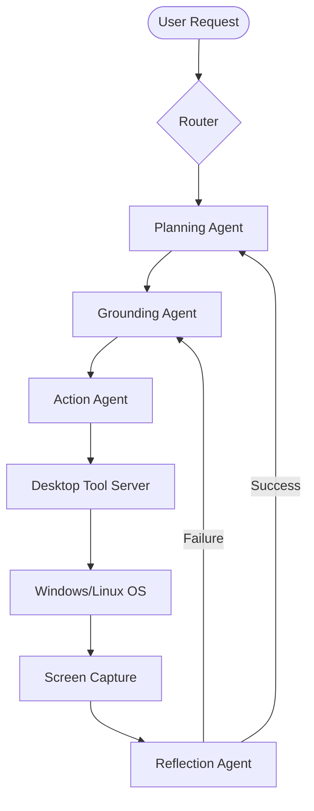

# Intel® OpenVINO™ Desktop Agent

[](https://docs.openvino.ai/)
[](https://github.com/intel/openvino)
[](https://www.python.org/downloads/)

The **Intel® OpenVINO™ Desktop Agent** is a high-performance, multi-agent automation system designed to perceive, reason about, and control desktop GUI applications. By leveraging the **OpenVINO™ Toolkit**, the agent runs state-of-the-art Vision-Language Models (VLM) and Large Language Models (LLM) fully local and offline, ensuring maximum privacy and low-latency execution on Intel hardware.

---

## 🚀 Key Features

- **Local & Offline Execution**: Zero cloud dependency. All reasoning and vision tasks happen on your Intel CPU/GPU/NPU.
- **Multi-Agent Architecture**: Discrete agents for Routing, Planning, UI Grounding, and Action Execution.
- **Optimized for Intel Hardware**: Powered by `Phi-3.5-Vision` and `DeepSeek-R1-Distill-Qwen-7B`, both optimized with OpenVINO™ INT4 quantization.
- **Perceptual Screen Monitoring**: Advanced screen capture with perceptual hashing (pHash) reduces processing overhead by 60-80%.
- **Secure Tool Execution**: Decoupled tool server handles low-level OS interactions (clicks, typing) via an internal API.

---

## 🏗 System Architecture

The agent follows a modular "See-Think-Act" loop:

1.  **See (Grounding Agent)**: Captures the screen and uses the VLM to identify UI elements and coordinates.
2.  **Think (Planning Agent)**: Breaks down user requests into discrete, actionable steps using the reasoning LLM.
3.  **Act (Action Agent)**: Sends commands to the local Tool Server to interact with the OS.
4.  **Verify (Reflection Agent)**: Checks the screen state after each action to ensure success or trigger corrections.



---

## 📋 Prerequisites

- **OS**: Linux (Ubuntu 22.04+ recommended) or Windows 10/11.
- **Hardware**: Intel® Core™ Ultra processor, 12th+ Gen Core™ CPU, or Intel® Arc™ GPU.
- **Memory**: Minimum 16GB RAM (32GB recommended for parallel model serving).
- **Software**: Docker & Docker Compose (for model serving), Python 3.10+.

---

## 🛠 Getting Started

### 1. Clone & Environment Setup
```bash
git clone https://github.com/your-org/intel-openvino-desktop-agent.git
cd intel-openvino-desktop-agent
python -m venv venv
source venv/bin/activate  # Linux
# or venv\Scripts\activate # Windows
pip install -r requirements.txt
```

### 2. Model Preparation
Download the optimized OpenVINO models using the included script:
```bash
bash scripts/setup/pull_models.sh
```

### 3. Start Model Servers
Deploy the VLM and LLM using Docker Compose:
```bash
docker-compose -f scripts/docker/docker-compose.yml up -d
```

### 4. Run the Tool Server
Start the local desktop control server (required for actions):
```bash
python -m tools.desktop_control.server
```

---

## 📈 Performance Baseline

Target latencies when running on Intel® hardware (e.g., Core™ Ultra 7):
- **VLM Inference (Phi-3.5V)**: ~1200ms - 1800ms
- **LLM Token Generation**: ~25-40 tokens/sec
- **Screen Capture & Hash**: < 50ms

To establish your local baseline, run:
```bash
python scripts/benchmarks/latency_benchmark.py
```

---

## 📂 Project Structure

```text
├── agents/             # Modular agent logic (Planning, Grounding, Action)
├── core/               # Screen capture, pHash, and OVMS client communication
├── configs/            # Model parameters and hardware hints
├── models/             # OpenVINO-optimized IR files (.xml, .bin)
├── scripts/            # Setup, benchmarking, and docker deployment
├── tools/              # Desktop Control Tool Server (pyautogui/mss)
└── ui/                 # Agent status and interaction overlay
```

---

## ⚖️ License
This project is licensed under the [Apache License 2.0](LICENSE). See the LICENSE file for details.
